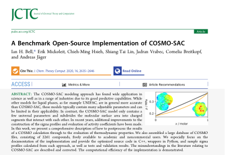

# COSMO-SAC

## About 



This repository contains our benchmark implementation of COSMO-SAC model described in [our paper in *J. Chem. Theory Comput.*](https://dx.doi.org/10.1021/acs.jctc.9b01016). The goal of this repository and paper is to "show our work" and provide a reproducible workflow for the use and development of COSMO-SAC-based models.

The C++ API documentation (generated by [doxygen](http://www.doxygen.nl/) ) is [available here](COSMOSAC-1.0-doxygen.pdf)

Automated Tests on TravisCI: [](https://travis-ci.org/usnistgov/COSMOSAC)

## License

*MIT licensed (see LICENSE for specifics), not subject to copyright in the USA. Foreign Rights Reserved, Secretary of Commerce.

The .cosmo files in the folders ``profiles/UD`` and ``profiles/VT2005`` are covered by less permissive licenses, for which the respective README file should be consulted.  Permission from BioVia was obtained to make the .cosmo files available for academic, non-commercial use.  For all other use, please contact ian.bell@nist.gov for more information.

## Dependencies

* Unmodified [Eigen](https://eigen.tuxfamily.org/dox/) for matrix operations
* Unmodified [nlohmann::json](https://github.com/nlohmann/json) for JSON management
* Unmodified [pybind11](https://github.com/pybind/pybind11) for C++ <-> Python interfacing

## Contributing/Getting Help

If you would like to contribute to ``COSMO-SAC`` or report a problem, please open a pull request or submit an issue.  Especially welcome would be additional tests.  

If you want to discuss or request assistance, please open an issue.

To get started, you should check out the Jupyter notebooks; they demonstrate some of the capabilities of this library.

## Installation

### Prerequisites

You will need:

* git 
* cmake (on windows, install from cmake, on linux ``sudo apt install cmake`` should do it, on OSX, ``brew install cmake``)
* Python (the anaconda distribution is used by the authors)
* a compiler (on windows, Visual Studio 2015+ (express version is fine), g++ on linux/OSX)

If on linux you use Anaconda and end up with an error something like
```
ImportError: /home/theuser/anaconda3/bin/../lib/libstdc++.so.6: version `GLIBCXX_3.4.20' not found (required by /home/theuser/anaconda3/lib/python3.6/site-packages/cCOSMO.cpython-35m-x86_64-linux-gnu.so)
```
it can be sometimes fixed by installing ``libgcc`` with conda: ``conda install libgcc``.  [This is due to an issue in Anaconda](https://github.com/ContinuumIO/anaconda-issues/issues/483)

If on OSX, if you install G++/GCC from homebrew (recommended), you may want to set the path to the compilers before you compile.  Something like this should do it:
```
export CC=/usr/local/bin/gcc-10
export CXX=/usr/local/bin/g++-10
```
then following the normal instructions

### From the git repository

Clone (recursively!) and run the ``setup.py`` script (the ``--shallow-submodules`` flag is optional, and checks out only the most recent commit of the submodules, saving rather a lot of data for Eigen)

```
git clone --recursive --shallow-submodules https://github.com/usnistgov/COSMOSAC
cd COSMOSAC
python setup.py install
```

to install, or 

```
python setup.py develop
```

to use a locally-compiled version for testing.  If you want to build a debug version, you can do so with

```
python setup.py build -g develop
```
With a debug build, you can step into the debugger to debug the C++ code, for instance.  

### Cmake build

Starting in the root of the repo (a debug build with the default compiler, here on linux):

``` 
git clone --recursive --shallow-submodules https://github.com/usnistgov/COSMOSAC
cd COSMOSAC
mkdir build
cd build
cmake ..
cmake --build .
```
For those using Anaconda on Linux, please use the following for cmake:
```
mkdir build
cd build
cmake .. -DPYTHON_EXECUTABLE=`which python`
cmake --build .
```
For Visual Studio 2019 (64-bit) in release mode, you would do:
``` 
git clone --recursive --shallow-submodules https://github.com/usnistgov/COSMOSAC
cd COSMOSAC
mkdir build
cd build
cmake .. -G "Visual Studio 17 2019 Win64"
cmake --build . --config Release
```

If you need to update your submodules (pybind11 and friends)
```
git submodule update --init
```

For other options, see the cmake docs
