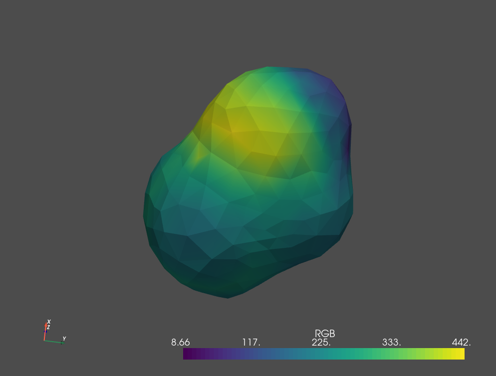

# cosmo_poly.py

This `cosmo_poly.py` script visualizes cosmo surface from cosmo segment data.



## Usage

In a terminal at `vis-poly` folder,
```termnial
python cosmo_poly.py --inpath ../profiles/GAMESS_TEST/ETHANOL.gout --outpath GAMESS_ETHANOL_COSMO.ply --target surf 
```

or in another python script,

```python
import cosmo_poly

inpath = 'profiles/GAMESS_TEST/ETHANOL.gout'
outpath = 'GAMESS_ETHANOL_COSMO.ply'
target = 'surf'

cosmo = cosmo_poly.CosmoView.read(inpath)
cosmo.save(outpath=outpath, target = target)
```

### input filetypes (`inpath`):

In the `inpath`  argument, cosmo data must be given. The script supports the following cosmo formats:
- `.cosmo`  from DMol3
- `.cosmo`  from Gaussian09
- `.gout`  from GAMESS

Samples can be found in profiles/DMol3_TEST, profiles/GAMESS_TEST, profiles/GAUSSIAN09_TEST and profiles/UD/cosmo.

### output filetypes (`outpath`):

In the `outpath`  argument, a output file with one of the following extensions must be given. The script supports general mesh formats  

- `ply`: Stanford Polygon
- `stl`: Standard Triangulated Language
- `obj`: Wavefront OBJ
- `off`: Object File Format
- `gltf`: GL Transmission Format

and point position data formats
- `.pcd`  point cloud data
- `.xyz`  xyz coordinate data 
- `.xyzn`  xyz coordinate + normal vectors

Note: `charge/area` normalized to [0:1] is stored as RGB in `ply`.

### types for processing (`types`):

Give `surf`  or `atom` for the `target`  argument. If `surf` is given, segment data is processed. Mesh or point data are saved depending on the extension given in the `outpath` argument.
If `atom`  is given, the position data is saved. In this case, only point data format is accepted.

## Prerequisites

-Open3d: https://pypi.org/project/open3d/

-pyvista: https://pypi.org/project/pyvista/

## What Does This Script Do?

The script reads cosmo data using a parser in to_sigma.py. Then, a surface mesh is constructed from the cosmo segment data using ball pivoting algorithm (open3d functionality).  Pyvista is a handy package for vizualization of mesh data. 

## How can I vizualize mesh data?

Some famous packages including
- paraview
- meshlab
- gmsh

support mesh data vizualization.

## Trouble?

If a generated mesh was not watertight, try to change `voxel_size` and `radii`. These values are associated to the pre-treatment and the ball pivoting algorithm for the surface reconstruction. Downscaling of mesh by increasing `voxel_size`  will truncate fine structure but ill-defined mesh can be avoided. 